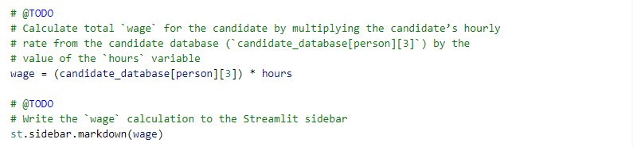
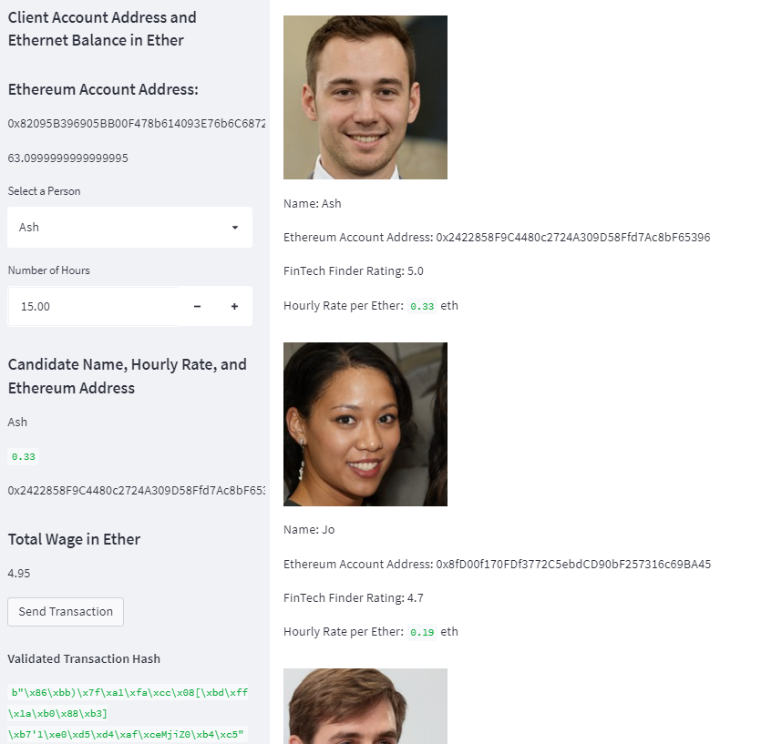
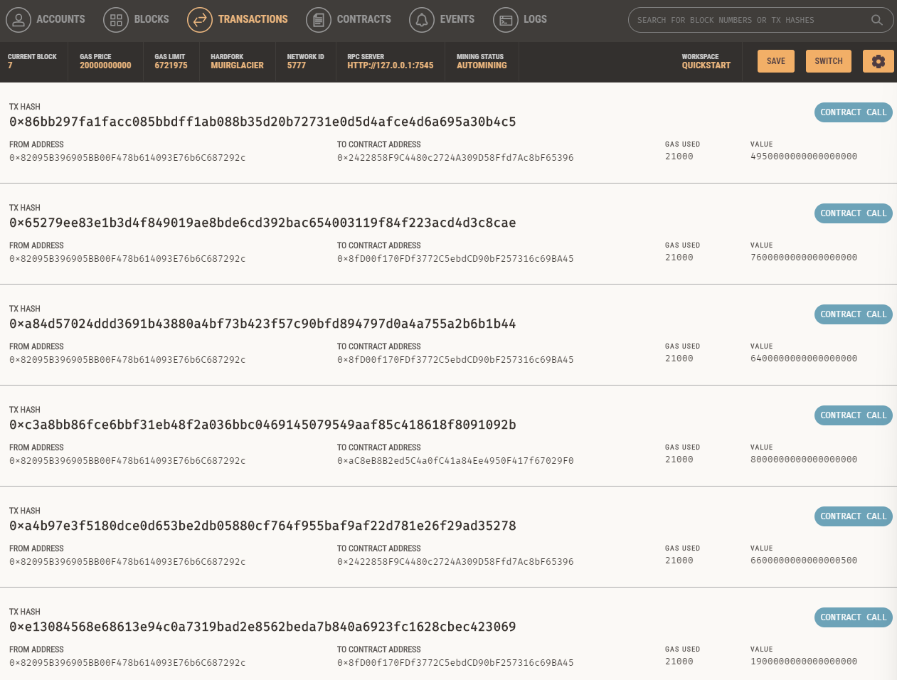
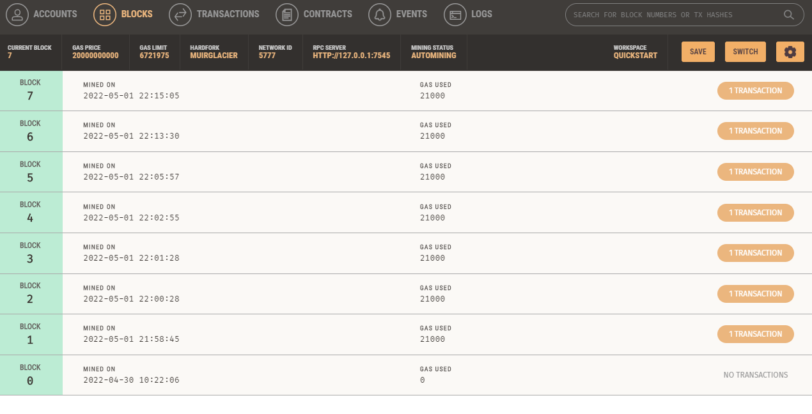
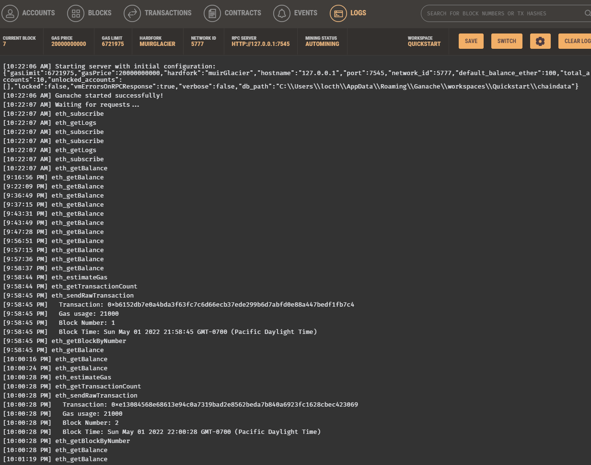
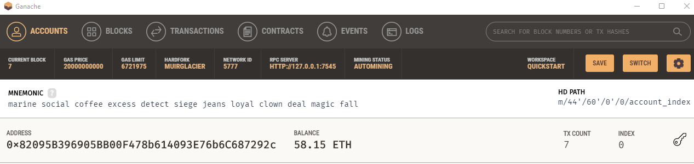

# Fintech-Finder
To build an application that its customers can use to find fintech professionals from among a list of candidates, hire them, and pay them. 


The steps for this project are divided into the following sections:

1. Generate a new Ethereum account instance by using the mnemonic seed phrase provided by Ganache.
2. Fetch and display the account balance associated with your Ethereum account address.
3. Calculate the total value of an Ethereum transaction, including the gas estimate, that pays a Fintech Finder candidate for their work.
4. Digitally sign a transaction that pays a Fintech Finder candidate, and send this transaction to the Ganache blockchain.
5. Review the transaction hash code associated with the validated blockchain transaction.


---

## Technologies

This project leverages Anaconda and JupyterLab with Python 3.9:

* [Anaconda](https://www.anaconda.com/products/individual) 

Need to import the following libraries and dependencies:

```
import streamlit as st
from dataclasses import dataclass
from typing import Any, List
from web3 import Web3
w3 = Web3(Web3.HTTPProvider('HTTP://127.0.0.1:7545'))

```

---

## Installation Guide

Before running the application first install the following dependencies.

1. Install [Anaconda](https://www.anaconda.com/products/individual) from link 
2. Open up GitBash(Windows) or Terminal(Mac)
3. Type ```conda update conda``` to update Conda
4. Type ```conda update anaconda``` to update Anaconda
5. Type ```conda create -n dev python=3.9 anaconda```
6. Type ```conda activate dev``` to activate conda
7. Install a dev environment kernel by typing ```python -m ipykernel install --user --name dev```
8. Install a node environment by typing ```conda install -c conda-forge nodejs```
9. Launch JupyterLab by typing ```jupyter lab```

Open a terminal window, and then activate your ```dev``` virtual environment by running the following command:
```
conda activate dev 
```
Install Streamlit by running the following command:

```
pip install streamlit
```

---

## Usage

You will need to clone the repo so that you can run the application:

```
https://github.com/locthai2002/Fintech-Finder.git

```

Here are some screenshots from running the application:

## Import Ethereum Transaction Functions into the Fintech Finder Application


## Sign and Execute a Payment Transaction



## Inspect the Transaction








---

## Contributors

Loc Thai -- www.linkedin.com/in/loc-thai-69b8a2141
Phone: 415.400.9998

---

## License

MIT
